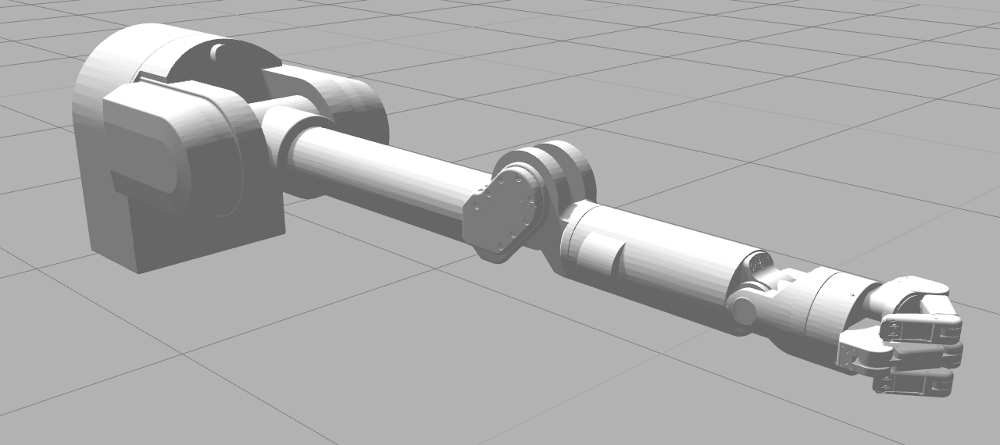
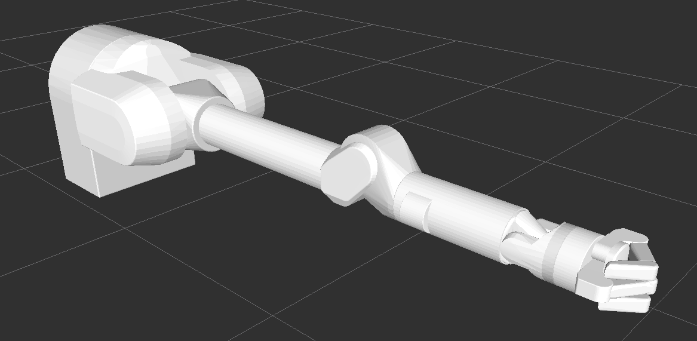

Barrett Model Modified Version
=============

In this model, we transfer the world frame to the center of the bottom of the base link. 

This repository contains Barrett WAM & BHand-280 CAD and modular URDFs with inertial properties.

The meshes and kinematics are based on publicly available resources from barrett.com. The dynamic properties are based on guidance from barrett.com as well as experiences with a real WAM and BH8-282.

## Visual

These are based on meshes exported directly from Solid Works.

## Collision Meshes

The meshes used for collsion are sets of convex meshes processed manually in Blender to capture important surfaces and geometry.

### Joint Naming Conventions

* macro: `wam_7dof`
    * macro: `wam`
        * `PREFIX/base_yaw_joint`
        * `PREFIX/shoulder_pitch_joint`
        * `PREFIX/shoulder_yaw_joint`
        * `PREFIX/elbow_pitch_joint`
    * macro: `wam_wrist`
        * `PREFIX/wrist_yaw_joint`
        * `PREFIX/wrist_pitch_joint`
        * `PREFIX/palm_yaw_joint`

* macro: `bhand`
  * `PREFIX/finger_1/prox_joint`
  * `PREFIX/finger_1/med_joint`
  * `PREFIX/finger_1/dist_joint`
  * `PREFIX/finger_2/prox_joint`
  * `PREFIX/finger_2/med_joint`
  * `PREFIX/finger_2/dist_joint`
  * `PREFIX/finger_3/med_joint`
  * `PREFIX/finger_3/dist_joint`

### How to use

1. Go to your python package directory (../python3.x/site-packages/rtbdata/xacro/wam_description)
2. Create an empty file "**barrett_model**"
3. In **barrett_model** file, open the terminal and input `git clone https://github.com/gaolongsen/Package_Adding.git`
4. Go to the "*py_file/URDF*", move the **WAM.py** file to the directory of "*python3.x/site-packages/roboticstoolbox/models/URDF*"
5. Open the __init.py__ and add `from roboticstoolbox.models.URDF.WAM import WAM`
6. Delete py_file directory
